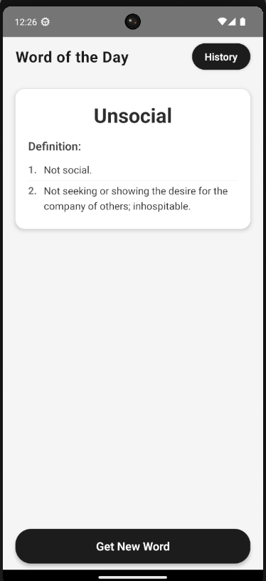
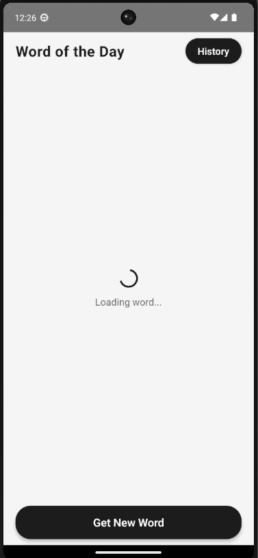
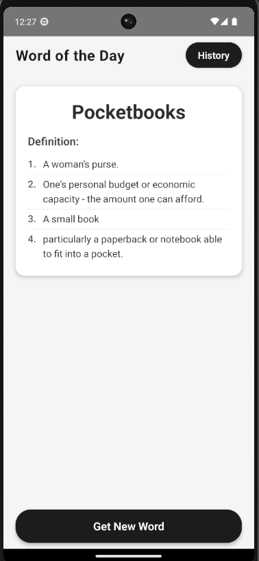
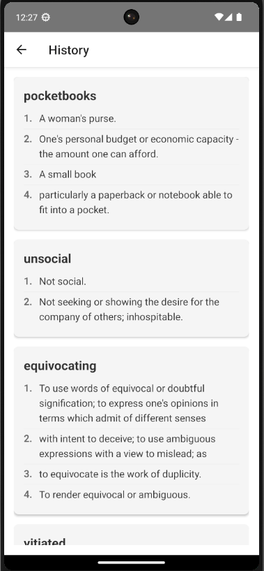

# Word of the Day

A React Native mobile application that helps users learn new words daily. The app fetches random words and their definitions, allowing users to expand their vocabulary while maintaining a history of previously viewed words.

## Features

- 🎯 Daily random word generation
- 📖 Detailed word definitions
- 📚 Word history tracking
- 💾 Persistent storage of word history
- 🎨 Clean and intuitive user interface
- 🔄 Easy word refresh functionality
- 🌓 Dark and Light theme support

## Screenshots

| Home Screen | Loading Screen |
|-------------|----------------|
|  |  |

| New Word | History Screen |
|----------|----------------|
|  |  |

## Tech Stack

- React Native
- TypeScript
- React Navigation
- AsyncStorage for data persistence
- Dictionary API for word definitions
- Random Word API for word generation

## Installation

1. Clone the repository:
```bash
git clone https://github.com/yourusername/wordoftheday.git
cd wordoftheday
```

2. Install dependencies:
```bash
npm install
```

3. Install iOS dependencies (for iOS development):
```bash
cd ios
pod install
cd ..
```

## Running the App

### For Android:
```bash
npm run android
```

### For iOS:
```bash
npm run ios
```

## Project Structure

```
src/
├── components/
│   ├── DefinitionList.tsx    # Component for displaying word definitions
│   └── WordContainer.tsx     # Container for word and definition display
├── context/
│   ├── AppContext.tsx        # Main application context
│   └── HistoryContext.tsx    # History management context
├── hooks/
│   └── useWord.ts           # Custom hook for word management
├── screens/
│   ├── HomeScreen.tsx       # Main screen with word display
│   └── HistoryScreen.tsx    # Screen for viewing word history
└── types/
    └── index.ts             # TypeScript type definitions
```

## API Integration

The app uses two main APIs:
- Random Word API: `https://random-word-api.herokuapp.com/word`
- Dictionary API: `https://api.dictionaryapi.dev/api/v2/entries/en/`

## Features in Detail

### Word Generation
- Fetches random words from the Random Word API
- Retrieves detailed definitions from the Dictionary API
- Displays multiple definitions when available

### History Management
- Saves viewed words and their definitions
- Persists data using AsyncStorage
- Allows users to review previously viewed words

### User Interface
- Clean and modern design
- Easy navigation between screens
- Loading indicators for better UX
- Responsive layout for different screen sizes
- Dark and Light theme support with smooth transitions

## Contributing

1. Fork the repository
2. Create your feature branch (`git checkout -b feature/AmazingFeature`)
3. Commit your changes (`git commit -m 'Add some AmazingFeature'`)
4. Push to the branch (`git push origin feature/AmazingFeature`)
5. Open a Pull Request

## License

This project is licensed under the MIT License - see the LICENSE file for details.

## Acknowledgments

- Random Word API for providing random words
- Dictionary API for comprehensive word definitions
- React Native community for the amazing framework
